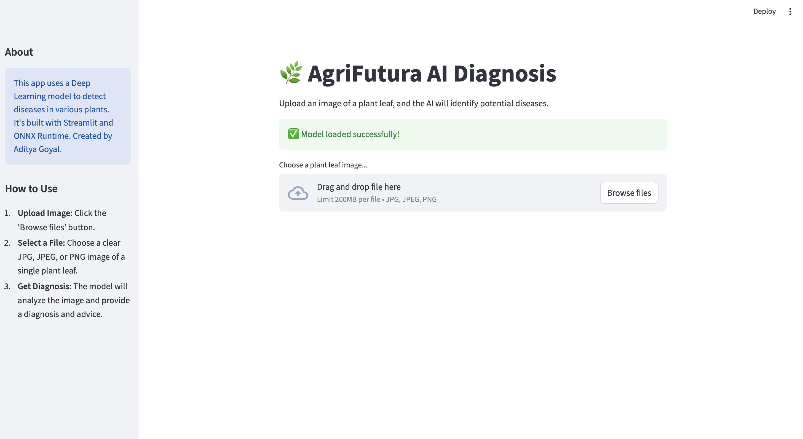

<div align="center">

# 🌿 AgriFutura AI Diagnosis 🌿

**An intelligent, real-time solution for automated plant disease detection and diagnosis.**

</div>

[](https://agrifutura-ai-diagnosis-4fbtwdayberrn8hcywonlt.streamlit.app/)
[](https://www.python.org/)
[](https://opensource.org/licenses/MIT)

---

### **[Live Demo](https://agrifutura-ai-diagnosis-4fbtwdayberrn8hcywonlt.streamlit.app/) • [Report a Bug](https://github.com/Aditya7615/AgriFutura-AI-Diagnosis/issues) • [Request a Feature](https://github.com/Aditya7615/AgriFutura-AI-Diagnosis/issues)**

AgriFutura AI Diagnosis is a deep learning-powered web application designed to help farmers and agricultural professionals quickly and accurately identify plant diseases from leaf images. By leveraging a state-of-the-art ensemble model, this tool provides an instant diagnosis and actionable advice to mitigate crop damage and improve agricultural outcomes.

<br>

<div align="center">
  
</div>

---

## ✨ Key Features

- **High-Accuracy Diagnosis:** Employs an ensemble Convolutional Neural Network (CNN) for robust and precise disease classification.
- **Intuitive & Accessible UI:** A clean, user-friendly interface built with Streamlit, requiring no technical expertise to operate.
- **Real-Time Predictions:** Delivers immediate diagnostic results and confidence scores upon image upload.
- **Actionable Insights:** Provides practical advice and treatment recommendations for identified diseases.
- **Efficient & Portable:** Uses the ONNX runtime for high-performance, cross-platform model inference.

## 🛠️ Technology Stack

| Category          | Technologies Used                               |
| ----------------- | ----------------------------------------------- |
| **Backend** | Python                                          |
| **Deep Learning** | TensorFlow, Keras                               |
| **Web Framework** | Streamlit                                       |
| **Model Serving** | ONNX Runtime                                    |
| **Data Handling** | NumPy, Pillow (PIL), Pandas                     |

## ⚙️ Setup and Installation

Follow these instructions to get the project running on your local machine for development and testing.

### Prerequisites

- Git & [Git LFS](https://git-lfs.github.com/)
- Python 3.10 or newer

### Step-by-Step Installation Guide

1.  **Clone the Repository:**
    ```sh
    git clone [https://github.com/Aditya7615/AgriFutura-AI-Diagnosis.git](https://github.com/Aditya7615/AgriFutura-AI-Diagnosis.git)
    cd AgriFutura-AI-Diagnosis
    ```

2.  **Install Git LFS and Pull Model:**
    This project uses Git Large File Storage (LFS) to handle the large model file. This step is crucial.
    ```sh
    git lfs install
    git lfs pull
    ```

3.  **Create and Activate a Virtual Environment:**
    ```sh
    # For macOS/Linux
    python3 -m venv venv
    source venv/bin/activate

    # For Windows
    python -m venv venv
    .\venv\Scripts\activate
    ```

4.  **Install Dependencies:**
    ```sh
    pip install -r requirements.txt
    ```

5.  **Run the Application:**
    ```sh
    streamlit run app.py
    ```
    Navigate to `http://localhost:8501` in your web browser to view the application.

## 🚀 Usage

1.  Launch the application locally or visit the **[Live Demo](https://agrifutura-ai-diagnosis-4fbtwdayberrn8hcywonlt.streamlit.app/)**.
2.  Click on **"Browse files"** to open the file uploader.
3.  Select a clear JPG, JPEG, or PNG image of a single plant leaf.
4.  The application will automatically analyze the image and display the diagnosis, confidence level, and treatment advice.

## 🔮 Project Roadmap

- [X] Deploy the application to Streamlit Community Cloud for public access.
- [ ] Develop a REST API endpoint for programmatic access to the model.
- [ ] Expand the dataset to include a wider variety of plants and diseases.
- [ ] Integrate a reporting feature for users to track diagnoses over time.

## 🙏 Acknowledgments

- The deep learning model was trained using the **PlantVillage Dataset**.
- The user interface was built with the amazing **Streamlit** library.

## 📜 License

This project is distributed under the MIT License. See the `LICENSE` file for more information.

---

## 👨‍💻 Connect with the Author

Feel free to reach out with questions, feedback, or collaboration proposals!

**Aditya Goyal**
- **GitHub:** [@Aditya7615](https://github.com/Aditya7615)
- **LinkedIn:** [linkedin.com/in/adityagoyal7615](https://www.linkedin.com/in/adityagoyal7615/)
